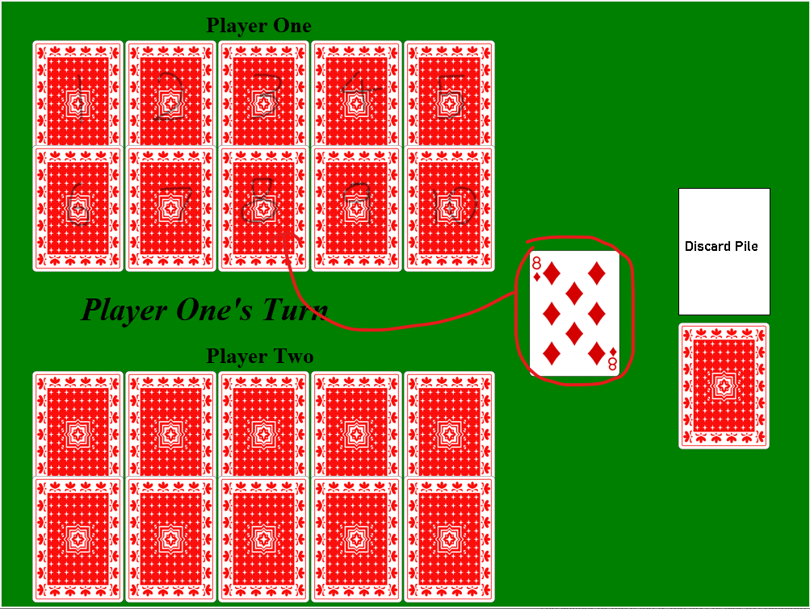

# Trash 
For our card game project we decided to recreate Trash. This games is for two players so the players decide who to be player 1 and 2 between themselves. At the start, each player is dealt 10 face down cards, 2 rows of 5 cards. Player 1 then draws from the pile and is able to place it on its respective position, realing and picking up the card that was originally there (Ace corresponds with 1, 2 corresponds with 2 etc.). Jacks are wild cards that can be placed in any position.\
Example:\
\
Turns continue until the player draws or reveals a card that cannot be played such as a Queen or King. A round ends when someone reveals all their cards. Cards are then reshufflued and dealt back to the players with the winner of the previous rounds having 1 less initial card. A player wins when a player only has 1 card to reveal and reveals it with an ace or Jack.